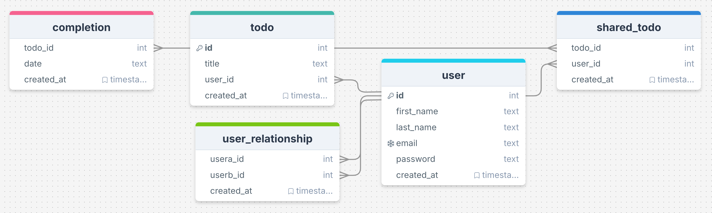

# Tick It Off

<div align="left">
  <a href="https://github.com/viliusddd/tick-it-off/actions/workflows/deploy.yaml">
    
  </a>
  <a href="https://codecov.io/gh/viliusddd/tick-it-off" >
    
  </a>
</div><br>

More organised than a queue at the post office, and just as satisfying to get through!

- [Tick It Off](#tick-it-off)
  - [Features](#features)
  - [Tech Stack](#tech-stack)
  - [TL;DR Setup](#tldr-setup)
  - [Database Diagram](#database-diagram)
  - [API Endpoints](#api-endpoints)
    - [todo](#todo)
    - [completion](#completion)
    - [user](#user)

## Features

- Use of pagination in todo list.
- Sign in/up.
- Password manager correctly recognize input fields.
- Share same types and validation schemas between backend and frontend.
- !WIP: Twilio Sendgrid integration
- Share todo with afriend.

## Tech Stack

<a href="https://postgresql.org">
  
</a>
<a href="https://typescriptlang.org">
  
</a>
<a href="https://trpc.io">
  
</a>
<a href="https://tailwindcss.com">
  
</a>
<a href="https://zod.dev">
  
</a>
<a href="https://expressjs.com">
  
</a>
<a href="https://nodejs.org">
  
</a>
<a href="https://vuejs.org">
  
</a>
<a href="https://vitest.dev">
  
</a>

## TL;DR Setup

1. Install dependencies

```sh
git clone git@github.com:viliusddd/tick-it-off.git && \

# backend
cd tick-it-off && \
npm i && \
cd server && \
cp .env.example .env && \
# adjust .env values
npm run migrate:latest && \
nvm use && \

# frontend
cd ../server && \
cp .env.example .env && \
# adjust .env values
```

2. Run app:

- Start PostgreSQL server.
- Adjust `.env` variables.
- Execute `npm run dev` in `server/` for backend and same in `client/` for frontend.

## Database Diagram

<div>
  <a href="https://drawsql.app/teams/my-team-2119/diagrams/tick-it-off/embed">
  
  </a>
</div>

- **completion** stores entries on when the todo item was completed.
- **todo** stores todo entries.
- **user** stores user information.
- **shared_todo** stores info on which users the todo item was shared with.

## API Endpoints

With the server running, go to <http://localhost:3000/api/v1/trpc-panel> to access available routes and their documentation.

### todo

<details open>

<summary>todo.findAll</summary>

Find all the todos that exist in the database for that user.

```sh
curl -s http://localhost:3000/api/v1/trpc/todo.findAll | jq
```

</details>

<details open>

<summary>todo.create</summary>

Create a new todo item.

> Need to log in with user.login endpoint first and then replace $ACCESS_TOKEN with the accessToken.

```sh
curl -s http://localhost:3000/api/v1/trpc/todo.create \
  -H 'Content-Type: application/json' \
  -H 'Authorization: Bearer $ACCESS_TOKEN' \
  -d '{"json": {"title": "bar"}}' | jq
```

</details>

<details>

<summary>todo.update</summary>

Update existing todo items.

```sh
curl -s http://localhost:3000/api/v1/trpc/todo.update \
  -H 'Authorization: Bearer $ACCESS_TOKEN' \
  -H 'Content-Type: application/json' \
  -d '{"json": {"id": 19, "title": "Foo bar baz"}}' | jq
```

</details>

<details>

<summary>todo.share</summary>

Share todo item that belongs to you with the other user.

```sh
curl -s http://localhost:3000/api/v1/trpc/todo.share \
  -H 'Authorization: Bearer $ACCESS_TOKEN' \
  -H 'Content-Type: application/json' \
  -d '{"json": {"userId": 2, "todoId": "3"}}' | jq
```

</details>

<details>

<summary>todo.deleteById</summary>

Delete todo item.

```sh
curl -s http://localhost:3000/api/v1/trpc/todo.deleteById?batch=1 \
  -H "Content-Type: application/json" \
  -d '{"0": {"json": {"id": 1}}}' | jq
```

</details>

### completion

<details>

<summary>completion.create</summary>

Create a new entry in the `completion` table. It will show as a checked todo item on that particular day.

```sh
curl -s http://localhost:3000/api/v1/trpc/completion.create \
  -H 'Content-Type: application/json' \
  -d '{"json": {"todoId": 7}}' | jq
```

</details>

<details>

<summary>completion.deleteById</summary>

Remove entry from the `completion` table. It will "uncheck" the todo item on that day.

```sh
curl -s http://localhost:3000/api/v1/trpc/completion.deleteById \
  -H 'Content-Type: application/json' \
  -d '{"json": {"todoId": 1}}' | jq
```

</details>

<details>

<summary>completion.findByRange</summary>

Get "checked" todo items from that day with the ID in the chosen range.
It's used when pagination loads to-do items in the app.

- `firstId` - first id of the range.
- `secondId` - last id of the range
- `date`* - date in ISO 8601 format, e.g. `2024-10-02`. By default, it's current day date.

```sh
N/A
```

</details>

<details>

<summary>completion.toggle</summary>

"Check" or "uncheck" the to-do item that day.

- `todoId` - todo item id.
- `date`* - date in ISO 8601 format, e.g. `2024-10-02`. By default, it's current day date.

```sh
curl -s http://localhost:3000/api/v1/trpc/completion.toggle?batch=1 \
  -H 'Content-Type: application/json' \
  -d '{"0": {"json": {"todoId": 1}}}' | jq
```

</details>

### user

<details>

<summary>user.login</summary>

```sh
curl -s http://localhost:3000/api/v1/trpc/user.login \
  -H "Content-Type: application/json" \
  -d @- << EOF | jq
{
  "json": {
    "email": "foo@bar.baz",
    "password": "foobar123"
  }
}
EOF
```

</details>

<details>

<summary>user.signup</summary>

```sh
curl -s http://localhost:3000/api/v1/trpc/user.signup \
  -H "Content-Type: application/json" \
  -d @- << EOF | jq
{
  "json": {
    "firstName": "foo",
    "lastName": "bar",
    "email": "foo@bar.bazz",
    "password": "foobar123"
  }
}
EOF
```
